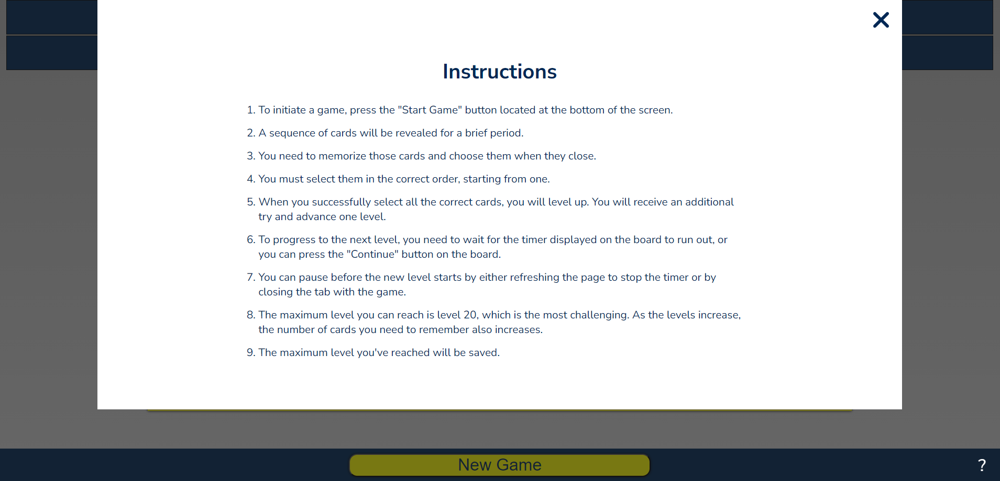
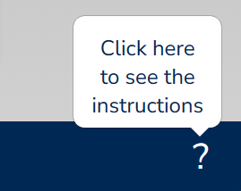
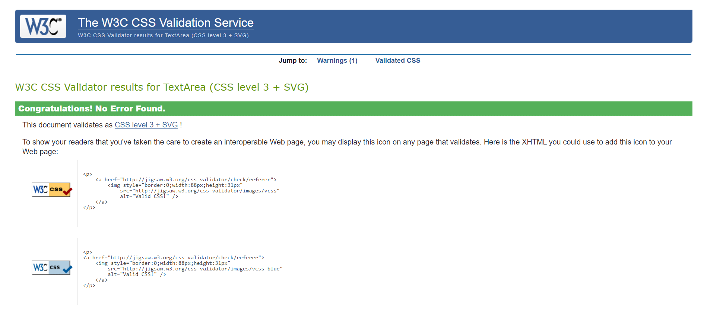
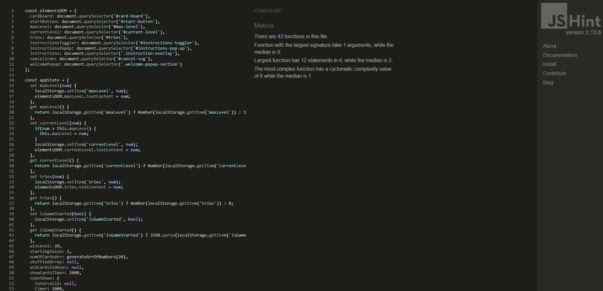

# Memory Game
A memory game introduces a distinct challenge by tasking players with memorizing the placements of hidden cards. At the outset, the cards are briefly exposed before being concealed once again. Players must rely on their memory to unveil the cards in the accurate numerical order. Victory in this game is achieved by successfully progressing through all 20 levels.

## Planning & Development
- __Target audience__
  - Individuals interested in enhancing their memory capabilities.
  - Those in search of engaging and challenging activities.
  - Individuals seeking friendly competition while playing a memory game.

- __Site Objectives__
  - Memory-Enhancing Gameplay: The website's key feature should revolve around a game specifically designed to improve memory skills.
  - User-Friendly Interface: The website's design and functionality should prioritize user-friendliness, enabling easy navigation and interaction.
  - Engagement-Centric Design: The website's presentation should be carefully designed to effectively captivate and engage users.

- __User story__
  - Intuitive Interaction: As a user, I anticipate that the website will offer easy and intuitive interaction.
  - Captivating Experience: In my user role, I look forward to an engaging and immersive game that effectively captures my attention and keeps me intrigued.
  - Skill Development: As a user, I aim to use this game as a practical tool to enhance my memory skills.
  - Demanding Challenge: In my user role, I expect the game to provide a significant level of challenge, pushing my abilities and ensuring long-lasting engagement.

- __Wireframes__
  - The game has been designed with responsiveness in mind, ensuring seamless gameplay across various devices including mobile phones, tablets, and desktop computers. Essential indicators will be prominently displayed at the top, providing key information to players. Meanwhile, at the bottom of the interface, a "Start" button will be positioned, enabling players to initiate the game with ease. The board game will be positioned at the center.

   
  

Mobile wireframe

    

  

  

Ipad wireframe

    
    
  

  

Desktop wireframe

    

  

  
- __Fonts__
- During the project planning phase, the primary objective was to enhance the user experience and provide maximum enjoyment. Regarding font selection, the choice was made to utilize the Nunito Sans font.

  - Nunito Sans

- __Colors__
- The color palette selection was a deliberate and meticulous process with the intention of creating an atmosphere of simplicity and comfort for all viewers. The primary hue of dark blue was chosen as the foundational shade, accompanied by the contrasting and vibrant yellow. Moreover, the palette includes several other colors.

  - main color: #002855;
  - main contrast color: #ffff00;
  - wrong color: #e3d44c;
  - text color: #e3d44c;
  - dark color: #000000;
  - light color: #ffffff;

  

- __Technologies__
  - JavaScript
  - HTML
  - CSS

## Instructions
  - To initiate a game, press the "Start Game" button located at the bottom of the screen.
  - A sequence of cards will be revealed for a brief period.
  - You need to memorize those cards and choose them when they close.
  - You must select them in the correct order, starting from one.
  - When you successfully select all the correct cards, you will level up. You will receive an additional try and advance one level.
  - To progress to the next level, you need to wait for the timer displayed on the board to run out, or you can press the "Continue" button on the board.
  - You can pause before the new level starts by either refreshing the page to stop the timer or by closing the tab with the game.
  - The maximum level you can reach is level 20, which is the most challenging. As the levels increase, the number of cards you need to remember also increases.
  - The maximum level you've reached will be saved.

## Features

### Responsiveness
In both the mobile and desktop versions, the game board comprises 20 cards. These cards fill the entire board, which spans the space between the indicator bar and the control bar. However, it's important to mention that the desktop version displays the board and cards in a slightly different layout and proportion, taking up less space. This customized design guarantees an optimal experience across various devices.

The image illustrates the website displayed on various devices.

  ;
  

### Game Indicators
At the top of the screen, three indicators are displayed: Max Level, Level, and Tries.

  - The "Max Level" indicator indicates the highest level you have achieved in the game. Importantly, your progress is automatically saved by the browser. Whenever you return to the game, your recorded achievement is prominently shown in the "Max Level" column, providing a convenient method to monitor your accomplishments.
  - The "Level" indicator provides an overview of your current progress in the game. Each time you correctly identify the necessary cards, you advance to the next level. As you continue, the game's complexity increases proportionally. The number of cards you need to uncover corresponds to your current level. For instance, at level 6, you will need to uncover 6 cards. It's important to note that the game's maximum level you can pass is level 20.
  - The "Tries" indicator shows the number of allowable mistakes you can make when selecting cards. Your initial number of attempts starts at zero. After successfully completing a level, your available tries increase by one. On the other hand, each time you select an incorrect card, your tally of tries decreases by one. If the total number of tries reaches zero and you choose an incorrect card, the game will conclude with a loss.

  

### Game Board
  The game board comprises 20 cards, each displaying only their reverse side. When the game is started, a certain number of cards will be momentarily revealed according to the current level. The player's objective is to remember both the revealed cards and their sequence within this brief exposure time. Afterward, the player must choose these cards in ascending order, relying on their memory to accurately recreate the sequence.

  

  Upon successfully selecting all the correct cards, they disappear from the board. In their stead, you are greeted with either a "Good Job" or "New Record" title, accompanied by a countdown timer positioned in the center of the board. Towards the bottom of the board, there exists a "Continue" button that presents you with the choice to proceed.

  

  At this point, you have various options: you can wait for the countdown to expire before starting the next level, press the "Continue" button to proceed, close the tab to exit the game, or reload the page. If you decide to reload the page, close the tab, or exit the browser your progress will be saved. When you come back to the game, you will see your current level title on the board and a button to continue.

  

### Controls (New Game button, instruction toggler)
At the bottom of the screen, you'll notice a control bar. 

In its center, there's a "New Game" button that, upon clicking, starts the game from its initial level.
 
On the right side of this bar, you'll find a question mark icon. Clicking on it will display the game instructions.

 

When the page loads, a popup appears above the instruction toggler, informing the user to click the toggler for the game instructions.

## Testing 

### Validator Testing 
- __W3C HTML Validator__
  - The index.html file has been validated using the W3C HTML Validator, with no errors or warnings found.

Validated code image (HTML Validator)

  ;
  

 

- __W3C CSS Validator (Jigsaw)__
  - The CSS code has been validated using the W3C CSS Validator (Jigsaw), and no errors were found.

Validated code image (CSS Validator)

  ;
  

 

  - The only warning that was found pertains to the imported Google font, which is an external link and therefore cannot be validated.

Warning image (CSS Validator)

  ;
  

 

- __JSHint JavaScript Validator__
  - The JavaScript file has been validated using the JSHint JavaScript Validator, and no errors were detected. However, several warnings were identified, primarily related to the usage of ES6 features, such as arrow functions, let, and const.

Validated code image (JS Validator)

  ;

### Lighthouse
The Lighthouse reports exhibit outstanding results across all categories. SEO, Best Practices, and Accessibility have all achieved a flawless 100% score on both mobile and desktop platforms. Furthermore, Performance scores are commendable, with a score of 99 for desktop and a 95 for mobile. These outcomes underscore the website's quality and optimization.
 

Lighthouse report for mobile

  
  

Lighthouse report for desktop

  

### Manual Testing
  - Confirmed that indicators, the game board, and the controls are all being displayed accurately and appropriately.
  - The game starts when the New Game button is clicked.
  - The New Game button starts the game from the first level.
  - Upon successfully completing a level, a title, a countdown timer, and a continue button will appear on the board.
  - A title on the board will display as 'Good Job' if you successfully pass a level or as 'New Record' if you achieve the highest level.
  - When the countdown timer runs out, the game will automatically advance to the next level.
  - If the continue button is pressed, the game will progress to the next level.
  - When a level is successfully completed, both indicators the tries and the level will increase by one.
  - If a user selects the wrong card, that card will be highlighted, and the tries indicator will decrease by one.
  - If there are 0 tries left and the wrong card is chosen, a message indicating that the game is lost will be displayed on the board.
  - The highest achieved level will be saved as the Max Level. The Max Level is persistent and will be retained even if the page is reloaded or opened at a later time.
  - As the level increases, the difficulty also increases. The number of cards a user needs to uncover corresponds to the current level.
  - At the beginning of each level, the correct cards will be briefly revealed and then concealed again.
  - The cards need to be selected in ascending order, starting from one and going higher.
  - If a timer has not yet finished and the continue button has not been clicked, a user can reload or close the browser, and their progress will be saved.
  - If a user reloads the page or closes the tab while the game is in progress, the progress will not be saved, and the user will have to start from level 1.
  - Clicking the toggler will either display or close the instructions.
  - When you load the page, a popup above the instruction toggler will briefly appear.

### Fixed Bugs

#### Problem
The tries indicator used to decrease by one not only when a user selected a wrong card but also when a user interacted with the board by clicking on it. This happened regardless of whether the game was active or not. This situation resulted in users losing points they had earned, even without picking a wrong card, significantly impacting their user experience in a negative way.

#### Reason
The problem could have been avoided by adding multiple event listeners to each card, but the decision was made against this approach to avoid creating numerous event listeners. The issue occurred because a single event listener was added to the entire board instead, and the logic responsible for decreasing the tries indicator was situated within an else statement that lacked a proper condition check.

#### Fix
To resolve this issue, I addressed it by replacing the generic "else" statement with an "else if" statement. This new statement specifically checked whether the clicked element was a card before implementing the logic to decrease the tries indicator.

### Test against User stories
  - Intuitive Interaction: As a user, I anticipate that the website will offer easy and intuitive interaction.
    - The page features a simple and user-friendly design. Controlling the game is as easy as clicking the 'New Game' button. Afterward, the correct cards are momentarily displayed, providing a clear understanding of the task. If a user selects the wrong card or the correct cards in the wrong order, the chosen card is highlighted, allowing the user to make corrections. Despite the game's simplicity and user-friendliness, comprehensive instructions are available by clicking the question mark icon located on the right side of the control bar.

  - Captivating Experience: In my user role, I look forward to an engaging and immersive game that effectively captures my attention and keeps me intrigued.
    - This game is exceptionally captivating, presenting a well-structured system of rewards and consequences. Upon successfully completing a level, the level indicator rises, offering the user a gratifying sense of achievement. Moreover, as levels are passed, the increase in both the level and tries indicators contributes to user contentment. On the contrary, an incorrect card selection results in a decrease in the tries indicator, gently discouraging errors. Introducing a layer of healthy competition, the Max Level indicator functions as a motivator for users to engage repeatedly, aiming to surpass their personal best or even outdo other players. This blend of rewards, challenges, and competitiveness heightens the overall engagement of the game.

  - Skill Development: As a user, I aim to use this game as a practical tool to enhance my memory skills.
    - As the cards are briefly revealed for a short duration, users must maintain focus to achieve success in the game. Additionally, users need to remember not only the revealed cards but also their sequence, making this game ideal for enhancing memory and concentration skills.

  - Demanding Challenge: In my user role, I expect the game to provide a significant level of challenge, pushing my abilities and ensuring long-lasting engagement.
    - As the level increases, the difficulty also rises due to the addition of more cards to be revealed. Since users are required to remember both the opened cards and their specific order, the game becomes progressively more challenging.

## Deployment
- __The site has been deployed to GitHub Pages. The deployment process involves the following steps:__
    - Navigate to the Settings tab within this project's repository.
    - Select 'Pages' from the left-hand menu.
    - From the 'Source' section drop-down menu, choose the main branch.
    - After saving the main branch a link to the live project will be provided.

The link to the live project - https://oleksiyla.github.io/Project_2/

## Credits

### Content
- The Nunito Sans fonts were obtained from Google Fonts: https://fonts.google.com

### Media
- All SVG icons, including the favicon, were sourced from FontAwesome: https://fontawesome.com

### Code
- I reviewed the Medium website to gather information about implementing card flipping effects: https://medium.com/designer-recipes/understanding-card-flip-animation-using-css-391c40ed3136